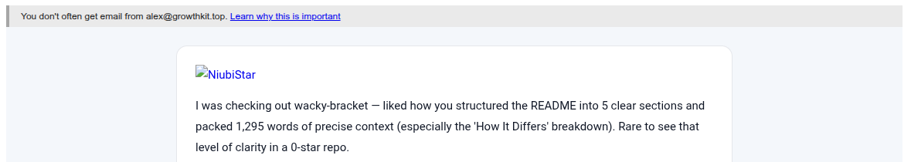

# wacky-bracket

A vibe-coded web app for displaying Wacky Racers tournament bracket.

## Run

```bash
npm install
npm run dev
```

In the main app, use **Open display popout** to launch a read-only bracket view.

You can also open it directly with `?view=display` (for example:
`http://localhost:5173/?view=display`).

The final round is auto-managed as a single-heat **Final** and is not configured in setup.

## Build

```bash
npm run build
npm run preview
```

## Code structure

- `src/hooks/useTournamentState.ts` manages tournament state, actions, persistence, and cross-window sync.
- `src/components/SetupPanel.tsx` (with setup tile subcomponents) contains setup/editing UI.
- `src/components/BracketPanel.tsx` contains bracket display/edit rendering.
- `src/App.tsx` is the composition root.

## Configuration rules

1. Round 1 participant slots must exactly match participant count.
2. For each round transition, total qualifiers from the current round must equal
   total entrant slots in the next round.
3. For each heat, `advanceCount` must be less than or equal to
   `participantSlots`.
4. The final round is derived from prior-round qualifiers and is always one heat.

Tournament configuration and results are persisted in `localStorage`. They can
be exported/imported via JSON.

## Bot compliments bot ❤️


